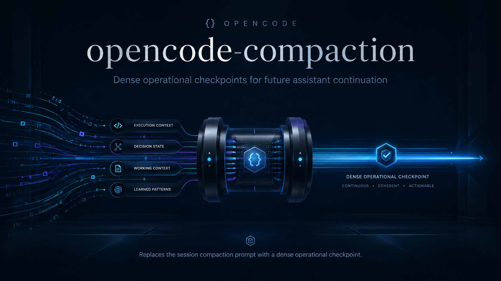

<p align="center">
  
</p>

# opencode-compaction

An OpenCode plugin that replaces the session compaction prompt with a dense,
operational checkpoint for future continuation. It preserves execution
continuity, decision state, active working context, and learned patterns
without copying the full transcript.

[](https://github.com/ReyJ94/Opencode-Operational-Checkpoint)
[](https://github.com/ReyJ94/Opencode-Operational-Checkpoint/releases/tag/v0.1.1)

> **The short version:** preserve the working state that matters, replace the
> compaction prompt with a structured checkpoint, and let the next assistant
> continue without rediscovering the session.

## Highlights

- **Operational continuity** — preserves the facts a future assistant needs to continue safely.
- **Bounded context** — incorporates accumulated context once, in order, without mutating it.
- **Structured checkpoint** — requires nine numbered sections and explicit epistemic labels.
- **Composable by design** — consumes the Sol Orchestrator snapshot when configured after it.
- **Minimal surface** — one server hook, no runtime dependencies, and no TUI replacement.

## Install

Install directly from GitHub:

```bash
opencode plugin github:ReyJ94/Opencode-Operational-Checkpoint
```

For local development, generate and install a tarball:

```bash
npm pack
opencode plugin ./opencode-compaction-0.1.0.tgz
```

## Configuration

When used with Sol Orchestrator, configure the orchestrator first and Compaction
second. OpenCode ignores `output.context` when a custom `output.prompt` is
present, so this ordering lets Compaction incorporate the orchestrator snapshot
into the prompt it replaces. OpenCode resolves this package's `exports["./server"]`
entry; no TUI configuration is required.

```json
{
  "plugin": [
    "opencode-sol-orchestrator",
    "opencode-compaction"
  ]
}
```

## Behavior

The plugin registers the `experimental.session.compacting` hook. When the hook
runs, it incorporates every non-empty accumulated `output.context` entry exactly
once, in order, without mutating the context array or its entries, and replaces
`output.prompt` with the operational checkpoint prompt.

The checkpoint prompt preserves execution continuity, decision state, active
working context, and learned operational patterns using nine numbered sections
and explicit epistemic labels.

When paired with Sol orchestrator, configure the orchestrator server plugin
first and this plugin second, as shown above. This package has no TUI export.
The separate `tui.json` entry belongs to `opencode-sol-orchestrator`; if you use
it, follow that package's README:

```json
{ "plugin": ["opencode-sol-orchestrator"] }
```

This plugin intentionally depends on the experimental hook. OpenCode may
change or remove that hook in a future release; compatibility is guaranteed
only for the hook shape and behavior supported by OpenCode `>=1.18.1`.

## Development

```bash
npm test
npm run check
npm run pack:dry-run
```

The repository has no build step and no runtime dependencies.

Repository: <https://github.com/ReyJ94/Opencode-Operational-Checkpoint>
